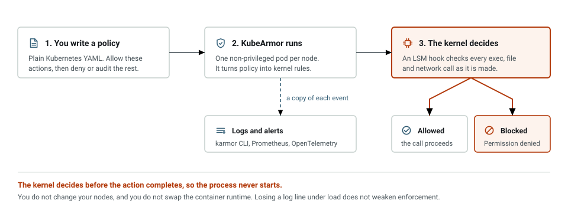
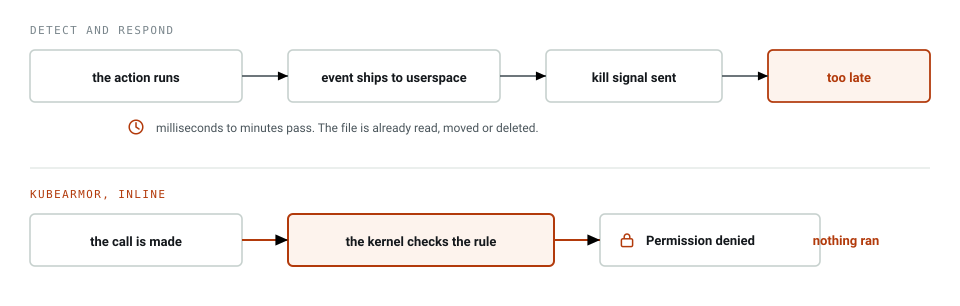
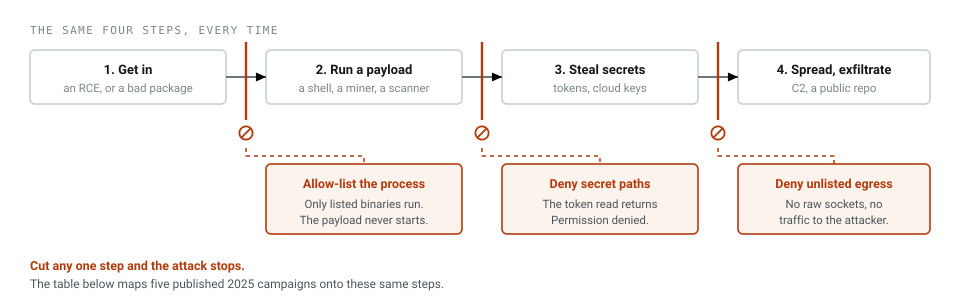
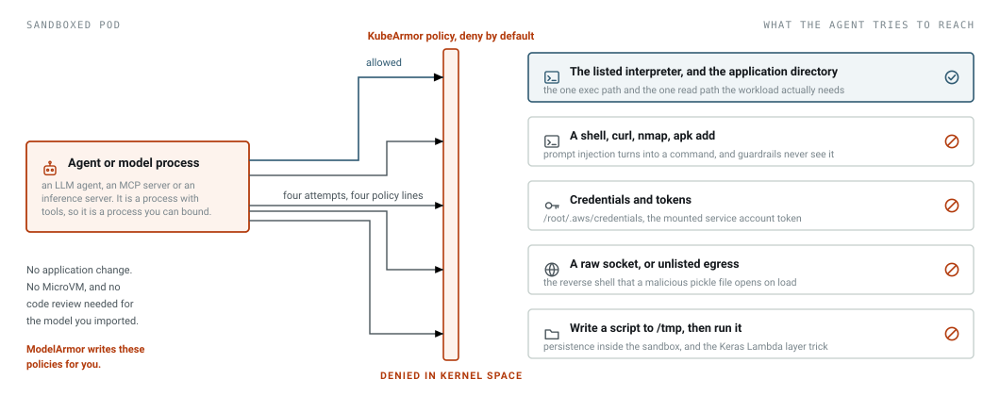

[](https://github.com/kubearmor/KubeArmor/actions/workflows/ci-test-ginkgo.yml/)
[](https://bestpractices.coreinfrastructure.org/projects/5401)
[](https://clomonitor.io/projects/cncf/kubearmor)
[](https://securityscorecards.dev/viewer/?uri=github.com/kubearmor/KubeArmor)
[](https://app.fossa.com/projects/git%2Bgithub.com%2Fkubearmor%2FKubeArmor?ref=badge_shield)
[](https://app.fossa.com/projects/git%2Bgithub.com%2Fkubearmor%2FKubeArmor?ref=badge_shield)
[](https://cloud-native.slack.com/archives/C02R319HVL3)
[](https://github.com/kubearmor/KubeArmor/discussions)
[](https://hub.docker.com/r/kubearmor/kubearmor)
[](https://artifacthub.io/packages/search?kind=19)

KubeArmor limits what a workload can do while it runs: which processes it can start, which files it
can touch, which network calls it can make. It works on pods, containers, VMs, and bare metal.

Most runtime security tools watch and then react. They spot a bad process and kill it, or they
quarantine the pod, after the code has already run. KubeArmor asks the kernel to refuse instead. The
check sits on a Linux Security Module hook, so an `exec` you did not allow returns `Permission
denied` and the process never starts.

|  |   |
|:---|:---|
| 💪 **[Harden Infrastructure](getting-started/hardening_guide.md)** <hr>🔗 Protect critical paths such as cert bundles <br>📋 MITRE, STIGs, CIS based rules <br>🧳 Restrict access to raw DB tables | 💍 **[Least Permissive Access](getting-started/least_permissive_access.md)** <hr>🚦 Process allow-listing <br>🚦 Network allow-listing <br>🎛️ Control access to sensitive assets |
| 🔭 **[Application Behavior](getting-started/workload_visibility.md)** <hr>🧬 Process execs, file system accesses <br>🧭 Service binds, ingress, egress connections <br>🔬 Sensitive system call profiling | ❄️ **[Deployment Models](getting-started/deployment_models.md)** <hr>☸️ Kubernetes deployment<br>🐳 Containerized deployment<br>💻 VM and bare-metal deployment |

## Install in 2 minutes

```sh
helm repo add kubearmor https://kubearmor.github.io/charts
helm repo update kubearmor
helm upgrade --install kubearmor-operator kubearmor/kubearmor-operator -n kubearmor --create-namespace
kubectl apply -f https://raw.githubusercontent.com/kubearmor/KubeArmor/main/pkg/KubeArmorOperator/config/samples/sample-config.yml
```

You do not need to change your nodes or swap the container runtime. The
[deployment guide](getting-started/deployment_guide.md) has the full walkthrough.

## Architecture

KubeArmor runs as a DaemonSet, one pod per node, without privileged access to the host. It reads
your policy and loads the matching rules through whichever LSM that node happens to have.



The orange path is the enforcement decision, taken at the LSM hook on the call the workload just
made. The dashed blue path is a copy of the same event, sent out as logs and alerts. If your cluster
gets busy and drops some of those events, you lose log lines and nothing else, because enforcement
never waits on userspace for an answer.

KubeArmor learns which container a process belongs to from the container runtime, over the CRI socket
today or over [OCI hooks](https://kubearmor.io/blog/kubearmor-oci-hooks-container-security) on newer
setups. OCI hooks let you drop the runtime socket mount.

## Where the decision happens

Falco, Tetragon, and KubeArmor all see the same syscall. What differs is when they get to act on
it.



The top row has to get through three steps before anything happens to the attacker, and you can
break it at any of them. Flood the ring buffer and the event never reaches userspace. Or simply
finish the job first, since deleting a file takes a couple of milliseconds and a response takes far
longer than that.

The bottom row is one step, and it runs in the kernel.

## How KubeArmor compares

| Engine | Model | Inline block | Allow-list policy | Sandboxing | Hardened distros | Overhead |
|---|---|:-:|:-:|:-:|:-:|:-:|
| **KubeArmor** | detect + inline LSM enforcement | ✅ | ✅ | ✅ | ✅ | Low |
| Tetragon | detect + kill or override return | ⚠️ | ✅ | ❌ | ⚠️ | Low |
| Falco + Talon | detect and respond | ❌ | ❌ | ❌ | ✅ | High |
| Tracee | detect only | ❌ | ❌ | ❌ | ✅ | High |
| NeuVector | detect + kill from userspace | ❌ | ✅ | ❌ | ✅ | High |
| gVisor | syscall interception in a guest kernel | ✅ | ✅ | ✅ | ❌ | High |
| Prisma Defender | runC shim replacement | ✅ | ✅ | ✅ | ⚠️ | High |

A few notes on those columns:

- **eBPF observes, LSMs enforce.** kprobes and tracepoints report an event. They cannot reject a
  syscall. `bpf_override_return()` can, but its own man page warns of security implications, and it
  needs `CONFIG_FUNCTION_ERROR_INJECTION` plus an error-injectable syscall. Most server distros ship
  without it.
- **A kill signal arrives after the code ran.** Post-attack response is open to TOCTOU bypass and to
  event floods that overflow the ring buffer. An LSM hook has neither problem.
- **No host change, no runC swap.** Engines that replace the runtime binary cannot install on
  Bottlerocket, Talos, or GKE COS without manual node work.

Want the longer version? Read [differentiation](getting-started/differentiation.md).

## Recent attacks, and the policy that stops them

All five of these are public 2025 write-ups. The entry points differ, but what the attacker does
next repeats: run a payload, read a secret, then talk to a host you never approved. You can put a
policy in front of any of those steps.



| Attack | What happened | Where KubeArmor cuts the chain |
|---|---|---|
| **React2Shell**<br>CVE-2025-55182, Dec 2025 | Unauthenticated RCE gave shell access inside pods. Actors harvested mounted service account tokens, queried RBAC, then deployed miners. [Unit 42](https://unit42.paloaltonetworks.com/modern-kubernetes-threats/) | Deny reads on `/var/run/secrets/kubernetes.io/serviceaccount/token`. Allow-list the app process, so `curl` and the miner never execute. |
| **Shai-Hulud npm worm**<br>Sep and Nov 2025 | A `postinstall` script harvested npm tokens, GitHub PATs, and cloud keys, then published them to public repos. A later variant wiped the home directory. [Wiz](https://www.wiz.io/blog/shai-hulud-npm-supply-chain-attack) | In CI and build pods, deny reads on `~/.npmrc`, `~/.aws/credentials`, and SSH keys. Deny egress except the registry. Deny writes outside the workspace. |
| **IngressNightmare**<br>CVE-2025-1974, Mar 2025 | Unauthenticated RCE in the ingress-nginx admission controller, whose service account can read Secrets in every namespace. [Wiz](https://www.wiz.io/blog/ingress-nginx-kubernetes-vulnerabilities) | Allow only `nginx` and its workers to execute in that pod. Deny writes to `/etc/nginx`. Deny the token read the next step needs. |
| **Dero miner in containers**<br>2025 | Attackers reached exposed Docker APIs, then a worm installed `masscan` and a Docker client inside running containers to spread. [Securelist](https://securelist.com/dero-miner-infects-containers-through-docker-api/116546/) | Deny `apt`, `apk`, `yum`. Deny `docker` and `kubectl` binaries in workload pods. Deny access to `/var/run/docker.sock`. |
| **nullifAI models**<br>Hugging Face, Feb 2025 | Two models carried pickle payloads that opened a reverse shell on load. The platform scanner did not flag them. [ReversingLabs](https://www.reversinglabs.com/blog/rl-identifies-malware-ml-model-hosted-on-hugging-face) | Sandbox the inference pod. Allow only the Python binary. Deny shell spawn, raw sockets, and unlisted egress. |

Everything in that last column is a policy you can apply today.
[policy-templates](https://github.com/kubearmor/policy-templates) has them written already, and
`karmor recommend` will generate them for a workload you point it at. The MITRE and CIS mapping lives
in the [hardening guide](getting-started/hardening_guide.md).

## Sandboxing AI agents

An agent is a process that runs commands on your behalf. Guardrails check the prompt and the
answer, which does nothing about the shell command the agent runs after somebody talks it into one.
[ModelArmor](https://docs.kubearmor.io/kubearmor/use-cases/modelarmor) uses KubeArmor to fence in
that process.



| Risk | What the attacker gets | Policy control |
|---|---|---|
| Prompt injection to shell | agent runs `curl`, `nmap`, `apk add` | Allow only the interpreter binary. Deny every other exec. |
| Credential theft | reads `/root/.aws/credentials`, the SA token | Block reads on secret paths. Allow the app path only. |
| Model supply chain payload | a pickle load opens a reverse shell | Deny raw sockets and unlisted egress from the model pod. |
| Persistence in the sandbox | writes a script to `/tmp`, then runs it | Deny write plus exec on writable directories. |

This works for any language runtime or AI framework, tool-calling agents, MCP servers, and
inference servers such as NVIDIA NIM included. You do not touch the application, and you do not need
a MicroVM for each workload.

- [ModelArmor overview](https://docs.kubearmor.io/kubearmor/use-cases/modelarmor)
- [Pickle code injection PoC](https://docs.kubearmor.io/kubearmor/use-cases/modelarmor/modelarmor-pickle-code)
- [modelarmor repository](https://github.com/kubearmor/modelarmor)

## Performance

The check happens in the kernel, so there is no trip to userspace on every call. These numbers come
from a 4-node AKS cluster on DS2_v2 nodes, running sock-shop under Apache Bench at 50,000 requests
and 5,000 concurrent:

| Case | Throughput (req/s) | Latency (ms) | KubeArmor CPU | KubeArmor memory | Failed requests |
|---|:-:|:-:|:-:|:-:|:-:|
| No KubeArmor | 2205.5 | 0.4534 | n/a | n/a | 0 |
| KubeArmor + policies (AppArmor) | 2169.4 | 0.4609 | 141 m | 112 Mi | 0 |

That is a 1.6% hit on throughput. The agent itself costs about 0.14 cores and 112 Mi per node.

The [full benchmark run](https://kubearmor.io/blog/KubeArmor-Performance-Benchmarking-Data) has the
per-reading tables and the BPF-LSM numbers. It was measured on the v1.0 line in March 2023.

## Documentation 📓

* 👉 [Getting Started](getting-started/deployment_guide.md)
* 🎯 [Use Cases](getting-started/use-cases/hardening.md)
* ✔️ [KubeArmor Support Matrix](getting-started/support_matrix.md)
* ♟️ [How is KubeArmor different?](getting-started/differentiation.md)
* 📜 Security Policy for Pods/Containers [[Spec](getting-started/security_policy_specification.md)] [[Examples](getting-started/security_policy_examples.md)]
* 📜 Cluster level security Policy for Pods/Containers [[Spec](getting-started/cluster_security_policy_specification.md)] [[Examples](getting-started/cluster_security_policy_examples.md)]
* 📜 Security Policy for Hosts/Nodes [[Spec](getting-started/host_security_policy_specification.md)] [[Examples](getting-started/host_security_policy_examples.md)]
* 📜 Network Security Policy for Hosts/Nodes [[Spec](getting-started/network_security_policy_specification.md)] [[Examples](getting-started/network_security_policy_examples.md)]<br>
... [detailed documentation](https://docs.kubearmor.io/kubearmor/)

### Contributors 👥

* 📘 [Contribution Guide](contribution/contribution_guide.md)
* 🧑‍💻 [Development Guide](contribution/development_guide.md), [Testing Guide](contribution/testing_guide.md)
* ✋ [Join KubeArmor Slack](https://cloud-native.slack.com/archives/C02R319HVL3)
* ❓ [FAQs](getting-started/FAQ.md)

### Biweekly Meeting

- 🗣️ [Zoom Link](http://zoom.kubearmor.io)
- 📄 Minutes: [Document](https://docs.google.com/document/d/1IqIIG9Vz-PYpbUwrH0u99KYEM1mtnYe6BHrson4NqEs/edit)
- 📅 Calendar invite: [Google Calendar](http://www.google.com/calendar/event?action=TEMPLATE&dates=20220210T150000Z%2F20220210T153000Z&text=KubeArmor%20Community%20Call&location=&details=%3Ca%20href%3D%22https%3A%2F%2Fdocs.google.com%2Fdocument%2Fd%2F1IqIIG9Vz-PYpbUwrH0u99KYEM1mtnYe6BHrson4NqEs%2Fedit%22%3EMinutes%20of%20Meeting%3C%2Fa%3E%0A%0A%3Ca%20href%3D%22%20http%3A%2F%2Fzoom.kubearmor.io%22%3EZoom%20Link%3C%2Fa%3E&recur=RRULE:FREQ=WEEKLY;INTERVAL=2;BYDAY=TH&ctz=Asia/Calcutta), [ICS file](getting-started/resources/KubeArmorMeetup.ics)

### Community & Governance

KubeArmor is a community-governed project. These documents describe how it is run:

| Document | What it covers |
|---|---|
| 📜 [Governance](./GOVERNANCE.md) | Roles, decision-making, vendor neutrality, sub-teams, voting. |
| 👥 [Maintainers](./MAINTAINERS.md) | Current Maintainers, Reviewers, and Emeritus, with affiliations. |
| 🤝 [Code of Conduct](./CODE_OF_CONDUCT.md) | We follow the [CNCF Code of Conduct](https://github.com/cncf/foundation/blob/main/code-of-conduct.md). |
| 📦 [Release Process](./RELEASES.md) | Cadence, release candidates, release manager, support window. |
| 🔒 [Security Policy](./SECURITY.md) | How to report a vulnerability. |

## Notice/Credits 🤝

- KubeArmor uses [Tracee](https://github.com/aquasecurity/tracee/)'s system call utility functions.

## CNCF

KubeArmor is a [Sandbox Project](https://www.cncf.io/projects/kubearmor/) of the Cloud Native Computing Foundation.


## ROADMAP

KubeArmor roadmap is tracked via [KubeArmor Projects](https://github.com/orgs/kubearmor/projects?query=is%3Aopen)

## Related Repositories

KubeArmor is more than a single repository. The repositories below, under the
[`kubearmor`](https://github.com/kubearmor) GitHub organization, are part of the wider project. Each
is governed under [GOVERNANCE.md](./GOVERNANCE.md), see the *Subprojects* section for how core and
community subprojects are classified.

> **Note:** This list covers actively maintained repositories. For the complete list, including
> archived ones, see the [organization page](https://github.com/orgs/kubearmor/repositories).

### Core

| Repository | What it is |
|---|---|
| [KubeArmor](https://github.com/kubearmor/KubeArmor) | The main runtime security enforcement daemon. This repository. |
| [kubearmor-client](https://github.com/kubearmor/kubearmor-client) | `karmor`, the official command-line tool for installing, configuring, and observing KubeArmor. |
| [charts](https://github.com/kubearmor/charts) | Official Helm charts for KubeArmor and the KubeArmor Operator. |
| [policy-templates](https://github.com/kubearmor/policy-templates) | Community-curated library of System and Network policy templates for KubeArmor (and Cilium). |
| [kubearmor.io](https://github.com/kubearmor/kubearmor.io) | Source for the [kubearmor.io](https://kubearmor.io) website. |
| [.project](https://github.com/kubearmor/.project) | Project metadata for CNCF `.project` automation (CLOMonitor, landscape, etc.). |

### Integrations and adapters

| Repository | What it is |
|---|---|
| [otel-adapter](https://github.com/kubearmor/otel-adapter) | OpenTelemetry receiver for KubeArmor events and alerts. |
| [kubearmor-prometheus-exporter](https://github.com/kubearmor/kubearmor-prometheus-exporter) | Prometheus exporter for KubeArmor metrics. |
| [kubearmor-relay-server](https://github.com/kubearmor/kubearmor-relay-server) | Relay/log streaming server that aggregates events from KubeArmor agents. |
| [kubearmor-kafka-client](https://github.com/kubearmor/kubearmor-kafka-client) | Kafka client for streaming KubeArmor logs to a Kafka cluster. |
| [kubearmor-log-client](https://github.com/kubearmor/kubearmor-log-client) | Standalone log client (stdout or file) for consuming KubeArmor logs. |
| [grafana-datasource](https://github.com/kubearmor/grafana-datasource) | Grafana data source backend for visualising KubeArmor data. |
| [kubearmor-dashboards](https://github.com/kubearmor/kubearmor-dashboards) | ELK-stack dashboards for KubeArmor logs and alerts. |
| [kubearmor-action](https://github.com/kubearmor/kubearmor-action) | GitHub Action that runs KubeArmor against a workload for CI security checks. |
| [rancherui](https://github.com/kubearmor/rancherui) | Rancher Manager UI extension for managing KubeArmor through Rancher. |
| [sidekick](https://github.com/kubearmor/sidekick) | Glue to connect KubeArmor events into downstream ecosystems. |

### Deployment and packaging

| Repository | What it is |
|---|---|
| [custom-packages](https://github.com/kubearmor/custom-packages) | Custom `.deb` / `.rpm` packaging definitions. |
| [packer-plugin-kubearmor](https://github.com/kubearmor/packer-plugin-kubearmor) | HashiCorp Packer plugin for baking KubeArmor into images. |

### Specialised projects

| Repository | What it is |
|---|---|
| [k8tls](https://github.com/kubearmor/k8tls) | (Pronounced *cattles*). Assesses server port security by detecting TLS and certificate configuration. |
| [modelarmor](https://github.com/kubearmor/modelarmor) | ML and AI workload security, including the pickle-injection PoC and adversarial-attack demos. |
| [kvm-service](https://github.com/kubearmor/kvm-service) | Service for orchestrating KubeArmor policies to VMs and bare-metal hosts via either a Kubernetes or non-Kubernetes control plane. |
| [libbpf](https://github.com/kubearmor/libbpf) | Go eBPF helper library based on the upstream libbpf API. |
| [kbc](https://github.com/kubearmor/kbc) | KubeArmor Benchmark Calculator. |

<!--
TODO: Confirm classification of each repository as **core subproject** (governed by this repo's GOVERNANCE.md, CODEOWNERS subset of Maintainers) versus **community subproject** (own MAINTAINERS file, autonomous on technical decisions but bound by CoC and vendor-neutrality clauses). This is CNCF DD blocker F.

Also, the following repositories have not been pushed to in over 12 months and may be candidates for archiving. Confirm with Maintainers before the next release:
  artefacts, certified-operators, marketplace-kubernetes, minikube, kubearmor.github.io, openhorizon-demo (already archived), test-enterprise-gha, runtime-security-best-practices, log4j-CVE-2021-44228, kastore, koach, KubeArmor-demo (last push 2023), tag-security, kubearmor-relay-server-KA (looks duplicated).
-->

This list grows by hand, so open a pull request to add a repository or fix a description.
